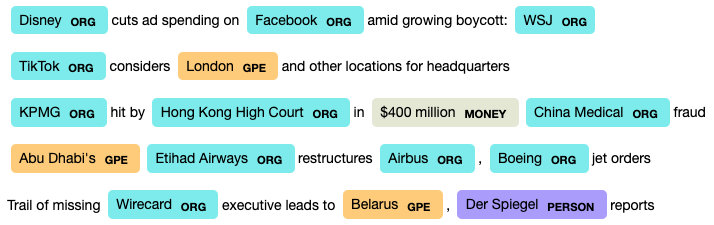

# Analyzing News Headlines with SpaCy

[SpaCy](https://spacy.io/) wraps industrial-strength natural language processing capabilites into a Python library with an elegant and powerful API. The notebook in this repo demonstrates its use for Named Entity Recognition (NER) on a real world news dataset.

We take a public domain dataset of [Reuters news headlines](https://www.kaggle.com/notlucasp/financial-news-headlines) and use spaCy to extract named entities. We demonstrate three example downstream use cases:

- investigating the organizations that appeared most often in Reuters in 2020
- viewing the mentions of any given organization over time
- inspecting which organizations appear in headlines together

## Deploying on Cloudera Machine Learning (CML)

There are three ways to launch this notebook on CML:

1. **From Prototype Catalog** - Navigate to the Prototype Catalog in a CML workspace, select the "Analyzing News Headlines with SpaCy" tile, click "Launch as Project", click "Configure Project"
2. **As ML Prototype** - In a CML workspace, click "New Project", add a Project Name, select "ML Prototype" as the Initial Setup option, copy in the [repo URL](https://github.com/cloudera/CML_AMP_SpaCy_Entity_Extraction), click "Create Project", click "Configure Project"
3. **Manual Setup** - In a CML workspace, click "New Project", add a Project Name, select "Git" as the Initial Setup option, copy in the [repo URL](https://github.com/cloudera/CML_AMP_SpaCy_Entity_Extraction), click "Create Project".

Once the project has been initialized in a CML workspace, run the notebook by starting a Python 3 Jupyter notebook server session. All library and model dependencies are installed inline in the notebook.

Happy hacking!

